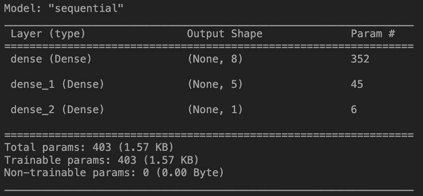
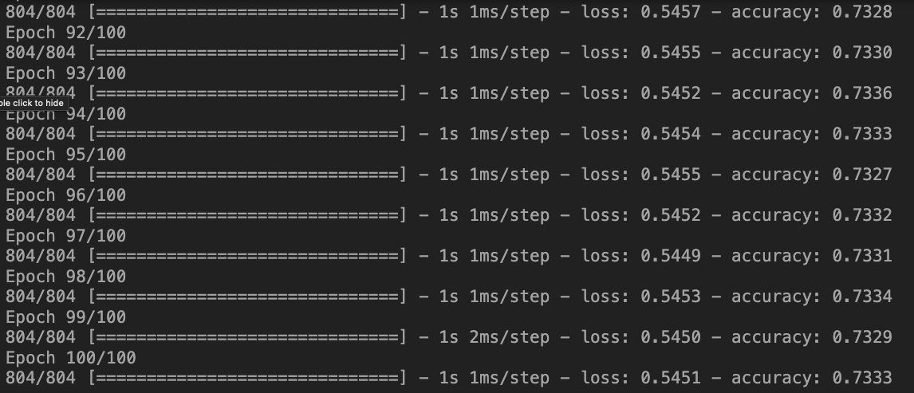

# Deep Learning Challenge

## Report

### Overview of the Analysis:

The nonprofit foundation, Alphabet Soup, is inquiring about a tool that can help find applicants for funding the foundation. In adddition to just simply finding people to fund, they want the best chance of success in their ventures. Using machine learning and neural networks, features in the provided dataset will be utilized to create a binary classifier. This can predict whether applicants will be successful if funded by Alphabet Soup.

The dataset is a CSV with more than 34,000 organizations that have received funding from Alphabet Soup over the years. Within this dataset are a number of columns that capture metadata about each organization.

## Results: 

### Data Pre-Processing

#### 1. What variable(s) are the target(s) for your model?

    The target variable is the `IS_SUCCESSFUL` column. This column is a binary variable that indicates whether or not the money was used effectively.

#### 2. What variable(s) are the features for your model?

    The features for the model are the `APPLICATION_TYPE`, `AFFILIATION`, `CLASSIFICATION`, `USE_CASE`, `ORGANIZATION`, `STATUS`, `INCOME_AMT`, `SPECIAL_CONSIDERATIONS`, and `ASK_AMT` columns.

#### 3. What variable(s) should be removed from the input data because they are neither targets nor features?

    The `EIN` and `NAME` columns were removed from the input data because they are neither targets nor features.

### Compiling, Training, and Evaluating the Model

#### 1. How many neurons, layers, and activation functions did you select for your neural network model, and why?

#### 2. Were you able to achieve the target model performance?

    No, the target model performance was not achieved. The model was able to achieve ~ 73% accuracy, but the target model performance was 75% accuracy. Reaching 73.3% accuracy was an improvement over the original model, which only achieved 72.6% accuracy.

#### 3. What steps did you take in your attempts to increase model performance?

By keeping the `Name` column aided in increasing the overall model performance, but by a miniscule amount. However, according to the instructions for this challenge, the `Name` column was to be removed. I did not see the reasoning as to why this was the case, therefore, i left that column out and kept the 73% accuracy.

## Summary:

According to the results seen in this deep learning model and as seen in class, the overall shape of the dataset before training the model is a good indicator of how the model will perform. In this case, the model performed well, but not well enough to meet the target model performance. In order to increase the model performance, I would suggest keeping the `Name` column from the dataset. This column is not a feature or a target, therefore, it should not be included in the dataset but it helps maintain the overall shape. In theory, removing this column should increase the model performance. Another suggestion would be to increase the number of epochs. By increasing the number of epochs, the model will be able to train longer and therefore, increase the overall model performance.

